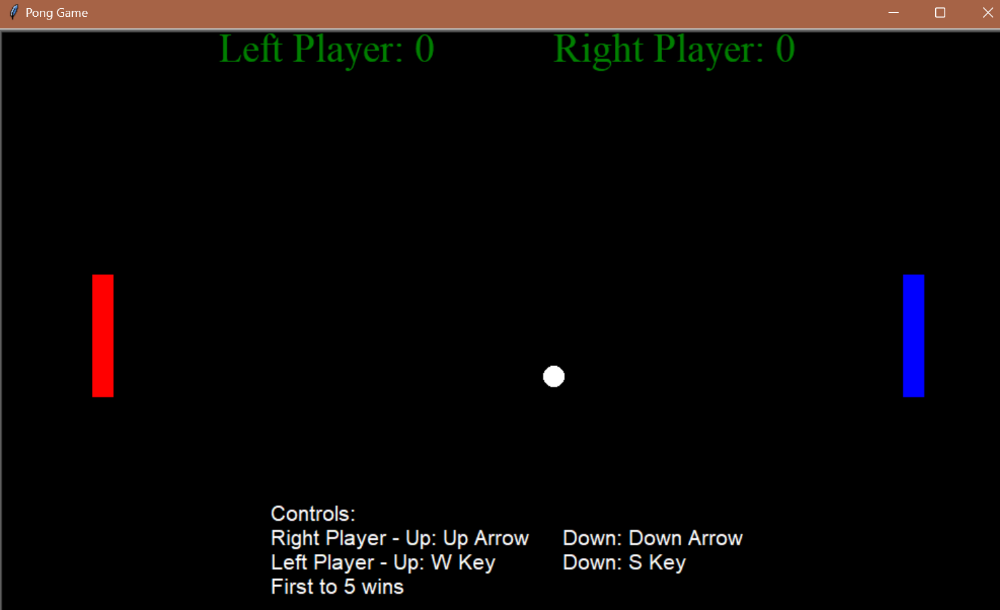
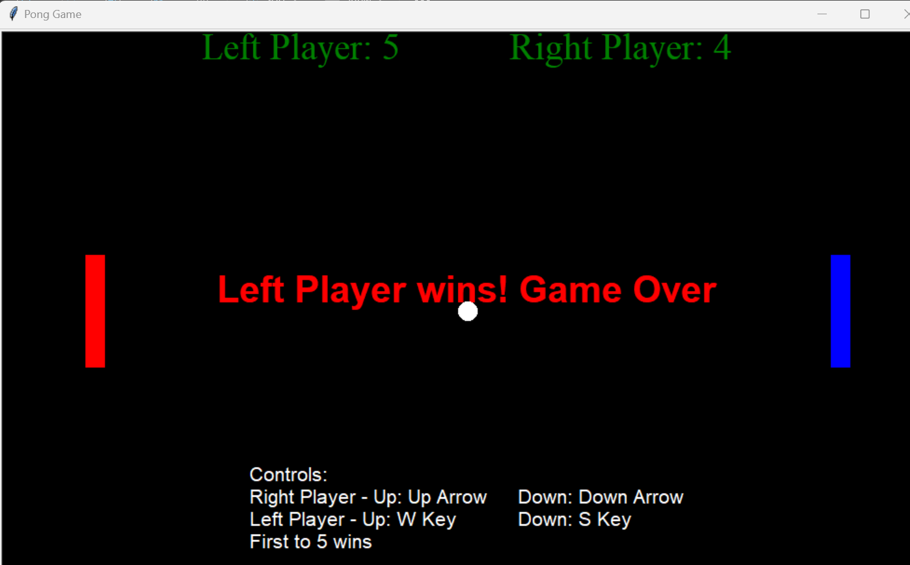
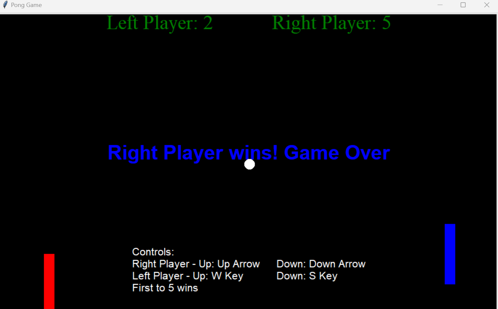

# ExplorationActivity1
## 1. Which package/library does the sample program demonstrate?
The sample program demonstrates the use of the Turtle [^1^] graphics library in Python, which provides a virtual representation of a physical "turtle," similar to a little robot equipped with a pen. This "turtle" moves across a drawing canvas and creates drawings or patterns by following a series of simple commands. In this code some examples of these commands include goto(), which is used to make the turtle draw a line. penup() which ensures no drawing while moving. and .xcor & .ycor which returns the turtle's x & y coordinates.  The instant, visible feedback provided by turtle graphics makes it an effective method for introducing programming concepts to beginners, which is why this library is used as an educational tool.

In the context of the sample program, Turtle graphics is used to create a classic Pong game, demonstrating how it can be employed to implement interactive graphical applications.

[^1^]: Python Turtle Graphics Documentation, https://docs.python.org/3/library/turtle.html

## 2. How to Run
1. Clone or download this repository to your local machine.
2. Navigate to the repository folder using the command line or terminal.
3. Run the program by executing the following command:
   python3 PongGame.py
Then the game window should open. Follow the instructions on the screen for up & down navigation. First to 5 wins and the game will end.

## 3. Program Purpose
The purpose of this program is to provide an interactive and educational implementation of the classic Pong game using Python's Turtle graphics library. The program was created for entertainment and to demonstrate the use and functionality of the turtle library through a fun game.

## 4. Sample Input/Output
## Sample Input:
The primary input for the Pong game is player interaction through keyboard inputs. The following are the typical keyboard inputs used to control the game:
- **Left Player**: Uses the 'W' key to move the paddle up and the 'S' key to move it down.
- **Right Player**: Uses the 'Up Arrow' key to move the paddle up and the 'Down Arrow' key to move it down.
These inputs allow players to control their respective paddles and interact with the game and control where the ball is going.
### Sample Output:
The output will vary based on the results of the game. Here are some examples of sample output:

1. **Real-time Visual Feedback**: Players see the movement of their paddles and the ball on the game screen. The ball's motion, bouncing off paddles and walls, is displayed through the graphics.

2. **Score Updates**: The program keeps track of the scores for both the left and right players. The current scores are displayed at the top of the game window so players can keep track of their progress.

3. **Closing Screen**: When one of the players reaches a score of 5,  the game displays a winning message in the center of the screen, indicating the victorious player.

**Examples of when the game is first loaded, when the right player wins, and when the left player wins provided as screenshots.**

